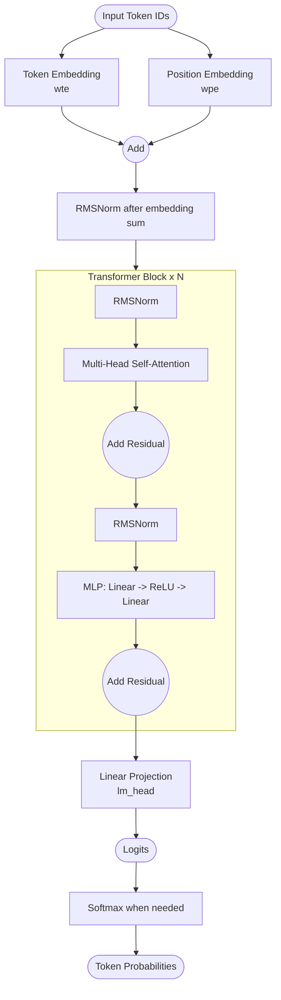

# go-microgpt

[microgpt.go](https://github.com/KEINOS/go-microgpt/blob/main/microgpt.go) is a Go port of [Andrej Karpathy](https://karpathy.ai/)'s [microgpt.py](https://gist.github.com/karpathy/8627fe009c40f57531cb18360106ce95) — a minimal GPT-2 you can read end-to-end in a single file. No frameworks, no abstractions — just the core mechanics.

Pure Go. Fully self-contained. Single-file implementation.

> [!NOTE]
> Built for learning: a structurally faithful (almost 1:1) port of `microgpt.py` to understand GPT internals. As the original implementation says, this project is not optimized for efficiency.

**What this project covers:**

- Automatic differentiation (backpropagation through a computation graph)
- Causal multi-head self-attention and transformer blocks
- Adam optimizer with learning rate scheduling
- Training and inference loops for sequence models

## Original Implementation

- Python: [gist.github.com/.../microgpt.py](https://gist.github.com/karpathy/8627fe009c40f57531cb18360106ce95) [[Rev. 14fb038](https://gist.githubusercontent.com/karpathy/8627fe009c40f57531cb18360106ce95/raw/14fb038816c7aae0bb9342c2dbf1a51dd134a5ff/microgpt.py)]
- Blog: [karpathy.github.io/2026/02/12/microgpt/](https://karpathy.github.io/2026/02/12/microgpt/)

## Quick Start

- Requirements: Go 1.22+
- Clone the repo or download [microgpt.go](https://raw.githubusercontent.com/KEINOS/go-microgpt/refs/heads/main/microgpt.go) and run:

```shellsession
% # Local run
% go run ./microgpt.go
num docs: 32033
vocab size: 27
num params: 4192
step 1000 / 1000 | loss 2.4143

--- inference (new, hallucinated names) ---
sample  1: arrien
sample  2: kale
sample  3: kavar
sample  4: janante
sample  5: delina
sample  6: aren
sample  7: mayia
sample  8: alee
sample  9: aryan
sample 10: avavee
sample 11: adane
sample 12: alian
sample 13: amai
sample 14: erid
sample 15: eride
sample 16: avace
sample 17: lele
sample 18: arina
sample 19: jarina
sample 20: elen
```

- Docker run:

  ```shellsession
  % # Docker run
  % docker run --rm -v "$(pwd)":/test -w /test golang:1.22-alpine go run ./microgpt.go
  **snip**
  ```

- Build and run:

  ```shellsession
  % go build -o microgpt ./microgpt
  % ./microgpt
  **snip**
  ```

- Run tests:

  ```shellsession
  % # Local run
  % go test .
  ok  github.com/KEINOS/go-microgpt  0.407s
  ```

  ```shellsession
  % # Docker run
  % docker run --rm -v "$(pwd)":/test -w /test golang:1.22-alpine go test .
  ok  github.com/KEINOS/go-microgpt  0.057s
  ```

## Configure

Edit constants in `microgpt/microgpt.go`:

```go
const (
    nLayer    = 1       // transformer layers (depth)
    nEmbd     = 16      // embedding size (width)
    blockSize = 16      // max sequence length per forward pass
    nHead     = 4       // attention heads (must divide nEmbd)
    numSteps  = 1000    // training iterations
    learningRate = 0.01 // Adam learning rate (0.01 used in original microgpt)
)
```

- Default: ~3,400 parameters.

> [!NOTE]
> The actual parameter count printed at runtime (e.g. `4192`) includes all learnable weights such as embeddings, attention projections, MLP layers, and RMSNorm scales.

**How each affects training:**

| Parameter | Increase | Effect |
| :-------- | :------- | :----- |
| `nLayer` | More layers | Larger model, slower training |
| `nEmbd` | Bigger size | More expressive, higher memory |
| `nHead` | More heads | Better attention patterns, slower |
| `blockSize` | Longer context | Model sees more history |
| `numSteps` | More iterations | Lower loss, longer training |
| `learningRate` | Higher value | Faster convergence, risks instability |

See [Karpathy's blog](https://karpathy.github.io/2026/02/12/microgpt/) for detailed explanations.

## Dataset

Character-level names dataset from [makemore](https://github.com/karpathy/makemore). Auto-downloaded on first run.

## Components

**Included:**

- Autograd system with manual backpropagation
- Causal multi-head self-attention, RMSNorm, feed-forward blocks
- Adam optimizer with bias correction
- Autoregressive sampling with temperature scaling
- Character-level tokenization

**Not included (by design):**

- Batching (kept simple to make execution easy to follow)
- Dropout/regularization
- Bias vectors
- Explicit causal masking tensor (causality is enforced by the autoregressive loop)

## Architecture Flow

The following diagram shows the forward-pass structure used in this repository's microgpt implementation.



> [!NOTE]
> Causality in "Multi-Head Self-Attention" is enforced by the autoregressive loop: no future tokens are ever computed, so no explicit attention mask is required in this implementation.
>
> - For more detailed comparison, see [gpt2-vs-microgpt.md](gpt2-vs-microgpt.md).

## Speed

This section is for reference only.

Even though this Go port runs ~9× faster than Python and can be further optimized, **performance is not the goal of this project**. Clarity and structural faithfulness is prioritized over all.

```shellsession
% hyperfine "python3 ./ref/microgpt.py" "go run ./microgpt.go"
Benchmark 1: python3 ./ref/microgpt.py
  Time (mean ± σ):     56.617 s ±  0.920 s    [User: 56.000 s, System: 0.499 s]
  Range (min … max):   55.537 s … 58.715 s    10 runs

Benchmark 2: go run ./microgpt.go
  Time (mean ± σ):      6.031 s ±  0.081 s    [User: 12.485 s, System: 1.024 s]
  Range (min … max):    5.909 s …  6.135 s    10 runs

Summary
  go run ./microgpt.go ran
    9.39 ± 0.20 times faster than python3 ./ref/microgpt.py
```

## References

- [たった200行のPythonコードでGPTの学習と推論を動かす【microgpt by A. Karpathy】](https://youtu.be/bR1SyyI7z1k?si=G5XPnE7j-luK53Tu) | [数理の弾丸⚡️京大博士のAI解説](https://www.youtube.com/@mathbullet) @ Youtube (in Japanese)

## License

- [MIT License](LICENSE)
- Authors:
  - [Andrej Karpathy](https://karpathy.ai/) (original Python implementation)
  - [KEINOS](https://github.com/KEINOS) and [the contributors](https://github.com/KEINOS/go-microgpt/graphs/contributors) (Go port)
