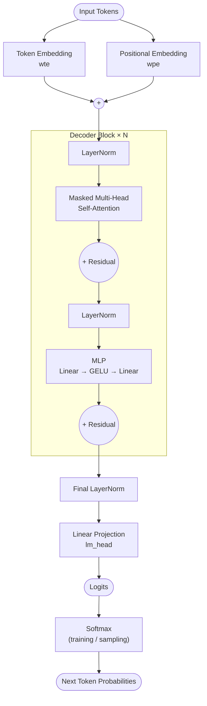
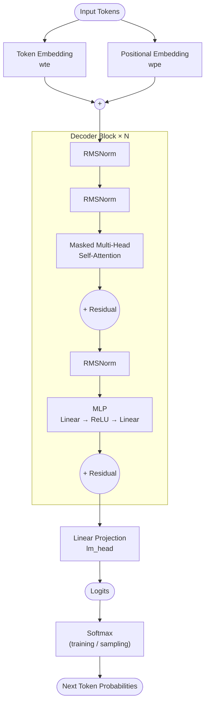

# GPT Architecture Diagrams

This document compares the canonical GPT-2 architecture with the distilled `microgpt.py` implementation by Andrej Karpathy.

---

## 1. Canonical GPT-2 Architecture

GPT-2 is a decoder-only Transformer that uses token embeddings, positional embeddings, stacked Transformer blocks, a final LayerNorm, and a linear projection to vocabulary logits. It uses LayerNorm and GELU, and its blocks use LayerNorm around each sublayer, shown here in a pre-normalization style for clarity.

The diagram is presented at a conceptual level to highlight components relevant to comparison.

Abbreviations in the diagram:

- `wte`: word token embedding table
- `wpe`: word position embedding table

---

## 2. microgpt.py Architecture

`microgpt.py` follows GPT-2 with three explicit simplifications: RMSNorm instead of LayerNorm, no biases, and ReLU instead of GELU. It also applies an RMSNorm immediately after the token and position embeddings are summed, and it omits the final LayerNorm before `lm_head`.

> Note: `microgpt.py` does not include a final LayerNorm before `lm_head`. It returns logits directly, and softmax is only applied for training loss computation and sampling.

---

## 3. Differences between the two

| Aspect | GPT-2 (Canonical) | microgpt.py |
| :--- | :--- | :--- |
| Normalization type | LayerNorm | RMSNorm |
| Norm after embedding sum | None | RMSNorm |
| Norm before attention | LayerNorm | RMSNorm |
| Norm before MLP | LayerNorm | RMSNorm |
| Final norm before `lm_head` | Yes | No |
| MLP activation function | GELU | ReLU |
| Bias terms | Yes | No |
| Output before softmax | Logits | Logits |
| Softmax location | Outside model | Outside model |

The three architectural simplifications explicitly stated by Karpathy are: LayerNorm → RMSNorm, no biases, and GELU → ReLU.

The two additional differences visible in the implementation are: an RMSNorm right after the embedding sum, and no final LayerNorm before `lm_head`.

---

## 4. Implementation notes

The `gpt(token_id, pos_id, keys, values)` function is functionally pure with respect to the model parameters, while autoregressive state is maintained externally via the key/value caches. This matches the implementation pattern in the provided code.

The attention computation is causal because each position only attends to keys and values accumulated up to the current position. Unlike standard implementations that apply an explicit causal mask, this implementation enforces causality implicitly by only accumulating past keys and values. The model uses a simple scalar autograd engine, so the code stays close to the mathematical structure of the algorithm rather than production-level optimized tensor code.

The model outputs logits, not probabilities. Softmax is applied only where needed: once for training loss and once for sampling during inference.
