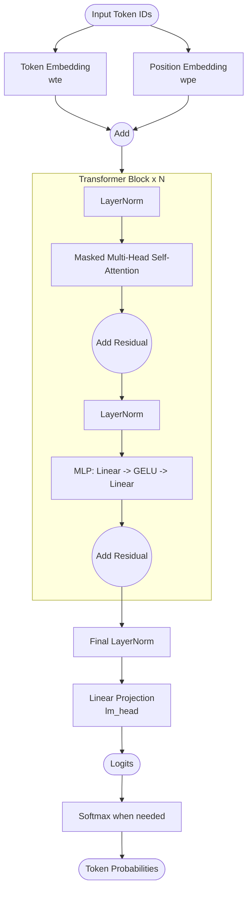
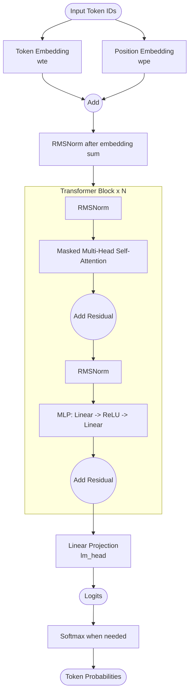

# GPT-2 Core and microgpt Simplifications

This note organizes two points while mapping canonical GPT-2 to `microgpt.py`:

1. What this repository treats as the GPT-2 core path.
2. What `microgpt.py` simplifies in the Python version.

## Why this comparison matters

`microgpt.py` is not a different model family. It keeps the decoder-only Transformer core from GPT-2. The main difference is that it removes or replaces parts that add complexity but are not central to this structural mapping.

In this note, the core path comes first, then the simplifications. This order makes the mapping from canonical GPT-2 to `microgpt.py` easier to track and understand for me.

## GPT-2 core path used in this note

This is the minimum GPT-2 core path used in this comparison:

1. Look up token and position embeddings and add them to form the input vectors.
2. Run a stack of Transformer blocks (implemented as a loop).
3. In each block:
    1. Attention + add input back (residual connection)
        - Run self-attention, then add its output to the original input of that sublayer (residual connection).
    2. MLP + add input back (residual connection)
        - Run Multi-Layer Perceptron (MLP), then add its output to the original input of that sublayer (residual connection).
4. Apply a linear layer to map hidden states to vocabulary logits.
5. Apply softmax outside the core forward pass when computing loss or during sampling.

Forward flow in this note:

- Input IDs -> Embeddings -> Stacked Blocks -> Logits

(Expressed in pre-normalization form for consistency across implementations.)

Inside each stacked block:

- Normalize input -> Self-Attention -> Add input back (residual connection) -> Normalize input -> MLP -> Add input back (residual connection)

```go
x = x + SelfAttention(Norm(x))
x = x + MLP(Norm(x))
```

(This corresponds to one iteration of a loop over layers.)

## Canonical GPT-2 (reference shape)

In canonical GPT-2, normalization is LayerNorm, the MLP uses GELU, and there is a final LayerNorm before the language-model head.

Abbreviations:

- `wte`: token embedding table
- `wpe`: positional embedding table
- `lm_head`: linear projection from hidden state to vocabulary logits



## microgpt.py (simplified shape for structural exploration)

`microgpt.py` keeps the same high-level flow, but simplifies internals.



## Changes in microgpt.py

### 1) LayerNorm -> RMSNorm

RMSNorm is simpler to implement in a scalar autograd system. Unlike LayerNorm, it does not include mean-centering.
In this note, it is handled as a simplification that keeps the same normalization role in block flow.

### 2) GELU -> ReLU

In `microgpt.py`, ReLU is used as the activation function in the MLP instead of GELU.
ReLU is simpler than GELU in both forward and backward logic.
In this minimal codebase, this lowers complexity without changing the overall architecture shape.

### 3) Bias terms removed

Linear layers do not include bias parameters. This reduces parameter count and simplifies parameter initialization and updates.

### 4) Extra norm after embedding sum

`microgpt.py` applies RMSNorm immediately after adding token and position embeddings. This stabilizes the scale of the combined embeddings before entering the first block.

### 5) No final norm before `lm_head`

Canonical GPT-2 uses a final LayerNorm before output projection. `microgpt.py` skips this and projects directly to logits.

## Implementation view for Go

In implementation terms, the forward pass follows the same conceptual pipeline as GPT-2: compute embeddings, run stacked blocks, and output logits.

The simplifications mostly reduce graph and parameter complexity:

1. Fewer parameter types to manage because there are no bias vectors.
2. Simpler activation and normalization math for autograd nodes.
3. Causality is enforced by storing and using only past keys and values, so an explicit mask tensor can be avoided in this minimal setup.

This keeps autoregressive behavior and makes the implementation easier to inspect.

## Quick comparison table

| Aspect | Canonical GPT-2 | `microgpt.py` |
| :--- | :--- | :--- |
| Model family | Decoder-only Transformer | Decoder-only Transformer |
| Block structure | Attention + MLP with residuals | Attention + MLP with residuals |
| Normalization type | LayerNorm | RMSNorm |
| Norm after embedding sum | No | Yes |
| MLP activation | GELU | ReLU |
| Dropout regularization | Yes | No |
| Linear bias terms | Yes | No |
| Final norm before `lm_head` | Yes | No |
| Output of forward pass | Logits | Logits |
| Softmax usage | Outside core path | Outside core path |

## Closing note

This comparison can be read in two layers:

1. Keep the GPT-2 core execution path.
2. Treat simplifications as math-level changes, not topology changes.

With that boundary, `microgpt.py` works as a compact structural map from canonical GPT-2 to a concrete implementation.
