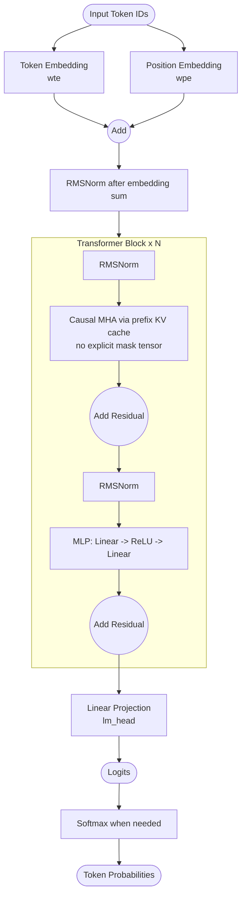
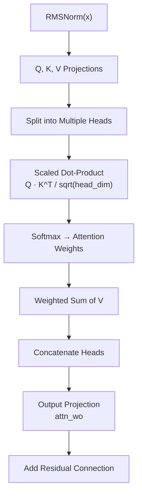
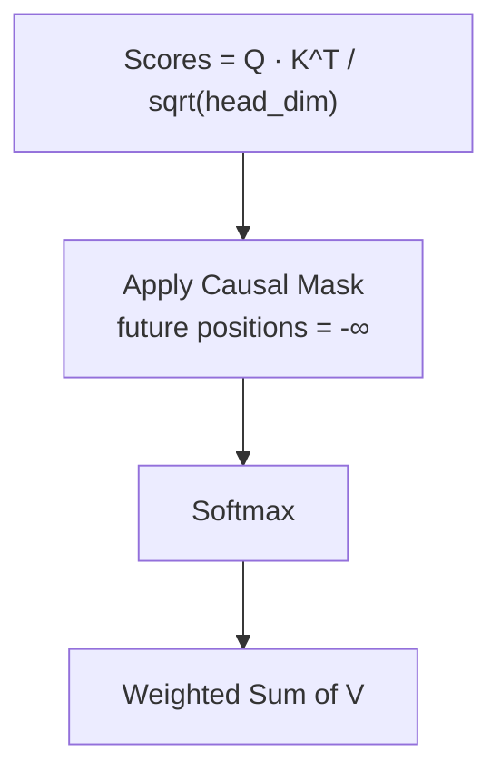
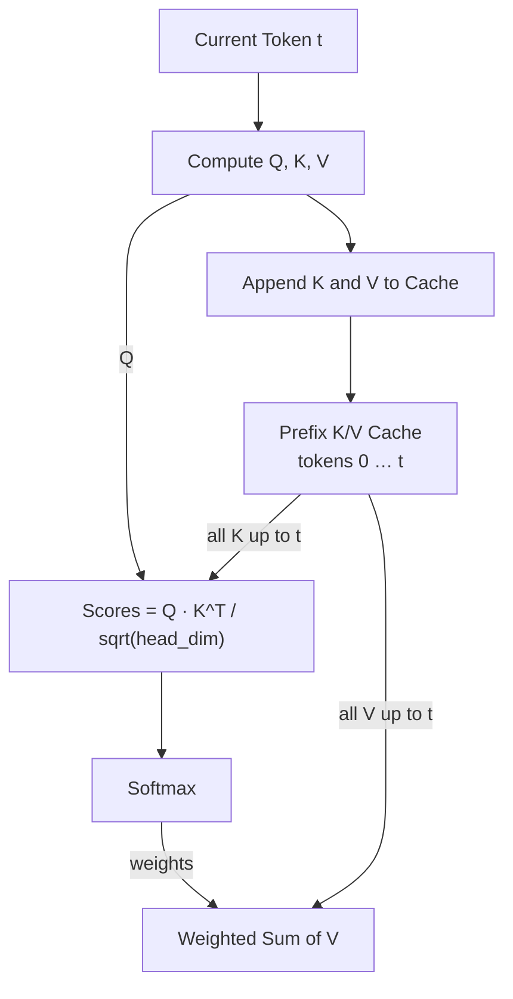

# GPT-2 Core and microgpt Simplifications

This note compares canonical GPT-2 with the microgpt implementation used in this repository, based on:

1. `ref/microgpt.py` (Python reference)
2. `microgpt.go` (Go port in this repository)
3. `README.md` (project-level architecture notes)

The goal is to separate what stays structurally GPT-2-like from what is intentionally simplified for learning.

## Scope and baseline

The baseline in this note is the decoder-only Transformer path:

1. Token + position embeddings are summed.
2. A stack of Transformer blocks is applied.
3. Each block performs attention and MLP sublayers with residual connections.
4. Hidden states are projected to vocabulary logits.
5. Softmax is applied outside the core forward path (loss/sampling stage).

In pre-norm form:

```go
x = x + SelfAttention(Norm(x))
x = x + MLP(Norm(x))
```

## Canonical GPT-2 (reference shape)

Canonical GPT-2 uses LayerNorm in blocks, GELU in MLP, and a final LayerNorm before `lm_head`.

Abbreviations:

- `wte`: token embedding table
- `wpe`: positional embedding table
- `lm_head`: projection from hidden state to vocabulary logits


## microgpt in this repository (Python + Go)

Both `ref/microgpt.py` and `microgpt.go` keep the same high-level flow and simplify internals.



## Simplifications used here

### 1) LayerNorm -> RMSNorm

RMSNorm is used instead of LayerNorm. It avoids mean-centering and is easier to express in a scalar autograd graph.

Important implementation detail:

- In `ref/microgpt.py` and `microgpt.go`, RMSNorm is parameter-free (no learnable gamma scale parameter), by design.

### 2) GELU -> ReLU

The MLP activation is ReLU instead of GELU. This simplifies forward/backward computation while keeping block topology unchanged.

### 3) Bias terms removed

Linear layers are implemented without bias vectors.

### 4) Extra norm after embedding sum

An RMSNorm is applied immediately after `wte + wpe`, before entering the first block.

### 5) No final norm before `lm_head`

Unlike canonical GPT-2, this implementation projects to logits directly after the last block.

### 6) Causality via autoregressive prefix, not explicit mask tensor

This implementation enforces causality by incremental prefix K/V accumulation (no explicit mask tensor). As a trade-off, it currently uses token-by-token forward passes instead of full-sequence parallel attention with masking.

#### Causal Masking in Attention

Both canonical GPT-2 and microgpt share almost the same **Multi-Head Self-Attention** mechanism at the computational level.
The core computation (QKV projection → scaled dot-product → softmax → weighted sum of Values) is identical.

The only major difference is **how they prevent the model from seeing future tokens** (causality).

##### Common Attention Flow (both implementations)



##### 1. Canonical GPT-2: Explicit Causal Mask

In standard GPT-2, the full sequence is processed in parallel.
To prevent attending to future tokens, an **explicit causal mask** is applied.



- Future token positions are masked by setting their scores to `-∞` before softmax, making their attention weights effectively zero.
- This is the classic approach used in most Transformer implementations.

##### 2. microgpt: Implicit Causality via Incremental K/V Accumulation

In microgpt, tokens are processed **one by one** during both training and inference.
For each position `t`:

- Compute Q, K, V for the current token.
- Append the current K and V to the prefix cache.
- Compute attention scores using the updated cache (all tokens 0 to t).



- No explicit causal mask tensor is needed.
- Causality is enforced **structurally** by the token-by-token execution order: tokens at positions `t+1, t+2, ...` have not been computed yet, so they cannot appear in the cache and cannot be attended to.
- The current token (position `t`) can attend to itself, which matches standard causal attention semantics.

This design significantly simplifies the attention code and makes the forward pass easier to follow, though it relies on token-by-token execution rather than batched full-sequence attention with masking.

This is one of the key simplifications that makes microgpt easy to understand and suitable for learning GPT internals.

### 7) No dropout regularization

Dropout is intentionally omitted for simplicity.

### 8) Separate `wte` and `lm_head` weights

`microgpt.go` keeps `wte` and `lm_head` as separate matrices to stay faithful to the Python reference in this repository.

## Implementation notes for the Go port

From `microgpt.go` and `README.md`:

1. The architecture is a direct educational port, prioritizing readability and structural faithfulness over efficiency.
2. Training and inference are both autoregressive, using token-by-token forward calls with incremental K/V accumulation.
3. Softmax remains outside the core block pipeline (cross-entropy in training, temperature sampling in inference).

## Quick comparison table

| Aspect | Canonical GPT-2 | microgpt in this repository |
| :--- | :--- | :--- |
| Model family | Decoder-only Transformer | Decoder-only Transformer |
| Block structure | Attention + MLP with residuals | Attention + MLP with residuals |
| Normalization type | LayerNorm | RMSNorm |
| Learnable norm scale | Yes (LayerNorm gamma/beta) | No (parameter-free RMSNorm, no learnable gamma scale parameter) |
| Norm after embedding sum | No | Yes |
| MLP activation | GELU | ReLU |
| Dropout | Used in training | Omitted |
| Linear bias terms | Used | Omitted |
| Final norm before `lm_head` | Yes | No |
| Causal masking | Explicit causal masking in attention logic | No explicit mask tensor (incremental prefix K/V cache) |
| `wte`/`lm_head` weight tying | Implementation-dependent across GPT-2 codebases | Not tied (separate matrices) |
| Output of forward pass | Logits | Logits |
| Softmax usage | Outside core path | Outside core path |

## Closing note

The structural takeaway is:

1. Keep the GPT-2 decoder-only execution path.
2. Apply simplifications that reduce autograd and implementation complexity.

With this boundary, `ref/microgpt.py` and `microgpt.go` are compact, inspectable maps of GPT-style modeling logic for learning.
